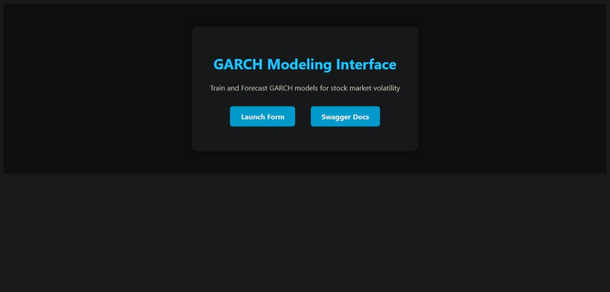
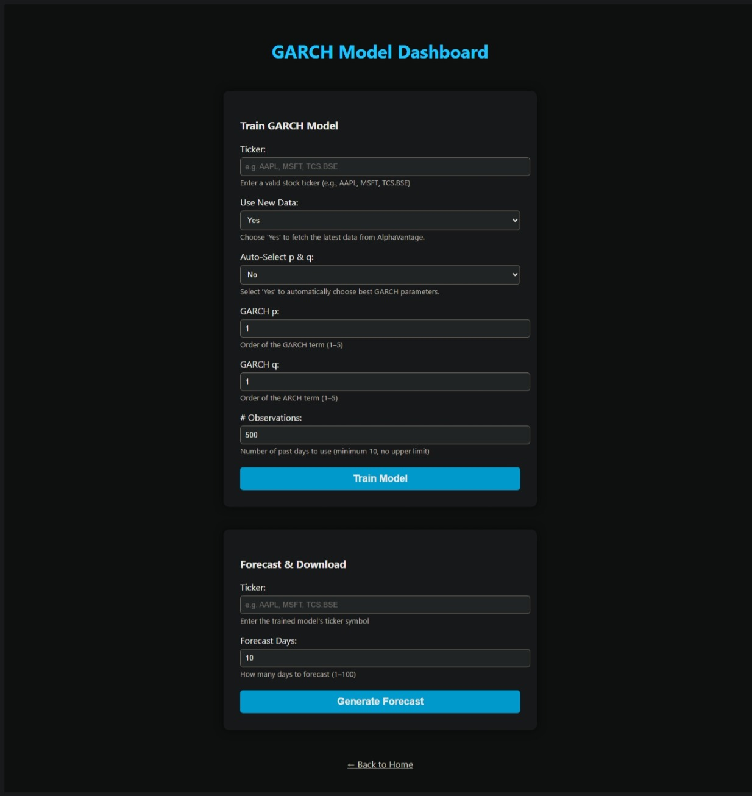

# GARCH Volatility Modeling Dashboard with FastAPI

An end-to-end interactive web application for modeling and forecasting stock market volatility using GARCH (Generalized Autoregressive Conditional Heteroskedasticity) models. Built with FastAPI and a responsive UI, the app supports both manual and automatic model selection, and enables users to analyze time-series volatility for global stock tickers — including those from exchanges like BSE, NSE, NYSE, LSE, and SSE.

A production-ready FastAPI application to **forecast stock market volatility** using GARCH (Generalized Autoregressive Conditional Heteroskedasticity) models. Built for both **technical** and **non-technical users** with FastAPI, it enables users to select a stock ticker (including international tickers from major global exchanges such as the Bombay Stock Exchange, New York Stock Exchange, London Stock Exchange, National Stock Exchange of India, Shanghai Stock Exchange, and more), train a GARCH model, and visualize or download future volatility forecasts with confidence intervals-all through a modern, user-friendly dashboard designed.


## Overview

Volatility modeling is crucial in financial risk management, options pricing, and algorithmic trading. This project builds a complete pipeline to:

- Real-time fetching of historical stock price data from **Alpha Vantage**
- Compute **log returns**
- Fit **GARCH(p, q)** models with manual or automated parameter selection
- Forecast **future volatility**
- Serve results via a **FastAPI web interface**
- Model diagnostics (AIC, BIC, Ljung-Box test)
- Visualize predictions directly in the browser or download as CSV

Supports:
- Grid search-based model selection (`auto` mode)
- Line chart visualization for forecast
- Easily extendable to support different volatility models (e.g., GJR-GARCH, EGARCH)

---

## FastAPI Web App Demo

### **Live Demo Screenshot**

## Demo

<p align="center">
  
  
</p>
<p align="center">
  <b>Left:</b> Landing page &nbsp; | &nbsp; <b>Right:</b> Dashboard for model training and forecasting
</p>

### **Demo Page Structure**

- **Home:** Entry point with navigation to the dashboard and API docs.
- **Dashboard:** 
    - Train GARCH Model: Select ticker, choose auto/manual parameters, fit model.
    - Model Diagnostics: View AIC, BIC, and residual test results.
    - Forecast & Download: Generate and visualize volatility forecasts, download as CSV.
    - Accessible, mobile-friendly, and visually appealing.

---

## Dataset

- **Source:** [AlphaVantage API](https://www.alphavantage.co/)
- **Data:** Daily adjusted close prices for user-specified stock tickers (supports global exchanges, e.g., `AAPL`, `TCS.BSE`)
- **Storage:** SQLite database (`stocks.sqlite`)
- **Usage:** Data is fetched on-demand or loaded from cache for reproducibility and efficiency.

---

## Project Structure

```bash
Stock_Volatility_Dashboard/
├── image                 # Images for demo
│   └── home_screenshot.jpg
│   └── dashboard_screenshot.jpg
├── notebooks/            # Jupyter EDA & experiments
│   ├── 01_data_exploration.ipynb
│   ├── 02_garch_testing.ipynb
│   └── 03_model_selection_analysis.ipynb
├── templates/            # Jinja2 HTML templates
│   ├── index.html
│   └── form.html
├── .env.example          # Example environment config file
├── CODE_OF_CONDUCT.md    # Code of conduct for contributors
├── config.py             # Config settings (e.g., DB/API keys)
├── CONTRIBUTING.md       # Contribution guidelines
├── data.py               # SQLite and API data handling
├── LICENSE               # Project license (e.g., MIT)
├── main.py               # FastAPI app with routes
├── model.py              # GARCH modeling logic
├── README.md             # Project documentation
└── requirements.txt      # Python dependencies 
```
---

## Notebooks

- **notebooks/EDA.ipynb:** Exploratory data analysis, visualization of returns and volatility, stationarity checks.
- **notebooks/model_dev.ipynb:** GARCH model prototyping, parameter tuning, and backtesting.
- *All notebooks are reproducible and can be run independently for research or teaching.*

---

## Model Architecture

- **Type:** GARCH(p, q) volatility model (via the [arch](https://arch.readthedocs.io/) Python package)
- **Parameter Selection:** Manual (user input) or automatic (BIC-based grid search)
- **Diagnostics:** AIC, BIC, Ljung-Box test for residual autocorrelation
- **Forecast Output:** Point forecasts and 95% confidence intervals for future volatility

---

## Dependencies

- Python 3.9+
- FastAPI
- Uvicorn
- Jinja2
- pandas
- numpy
- arch
- joblib
- statsmodels

---

## Usage

1. **Clone the repository:**
```
git clone https://github.com/Aminah-Dodiya/Stock_Volatility_Dashboard.git
cd garch-dashboard
```

2. **Set up your environment:**
- Create a `.env` file with your AlphaVantage API key and other settings (see `.env.example`).

3. **Install dependencies:**
```
pip install -r requirements.txt
```

4. **Run the FastAPI app:**
```
uvicorn main:app --reload
```
Visit [http://127.0.0.1:8000](http://127.0.0.1:8000) in your browser.

5. **Usage steps:**
- Enter a stock ticker (e.g., `AAPL`, `TCS.BSE`)
- Choose whether to auto-select GARCH parameters
- Train the model and review diagnostics
- Forecast volatility and download results as CSV

---

## Results

- **Model diagnostics** (AIC, BIC, Ljung-Box) are displayed after training.
- **Forecasts** are visualized with confidence intervals and available for CSV download.
- **Example output:**  
```
| Date           | Volatility | Lower CI | Upper CI |
|----------------|------------|----------|----------|
| 2025-04-30     | 1.38       | 0.53     | 2.24     |
| ...            | ...        | ...      | ...      |
```

---

## Future Work

- Add support for EGARCH, TGARCH, and other volatility models
- Enable batch/bulk forecasting for multiple tickers
- Integrate additional data sources (e.g., Yahoo Finance)
- Deploy as a cloud-hosted service (with authentication)
- Add user accounts and persistent model management
- Enhance UI with interactive zoom/pan and more analytics

---

## Contributing

Contributions are welcome! To contribute:

1. Fork the repository
2. Create a new branch (`git checkout -b feature/your-feature`)
3. Commit your changes
4. Push to your fork (`git push origin feature/your-feature`)
5. Open a Pull Request

Please see [CONTRIBUTING.md](CONTRIBUTING.md) for guidelines.

---

## License

Distributed under the MIT License. See [LICENSE](LICENSE) for details.

---

## Ethical Considerations

- **Financial data and forecasts are for educational and research purposes only.**  
This app does not constitute investment advice.
- **Respect API rate limits and terms of service** for AlphaVantage and any other data providers.
- **Do not use this tool for high-frequency or automated trading without proper risk controls.**
- **Open source:** Contributions should not include proprietary or sensitive data.

---

## Contact

For questions, suggestions, or issues, please open an issue on GitHub or contact [aminah.dodiya.3@gmail.com](mailto:your.email@example.com).

---
